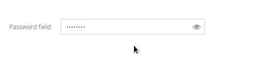

# App.ux.TogglePasswordField
 > A password field with password visibility toggle trigger
 
 

## Usage
 - Copy the class to your application
 - Create a field with the `ux-togglepasswordfield` xtype
 - Customize it by changing the `charsVisibility`, `showPassHint` or `hidePassHint` configs

Demo: https://fiddle.sencha.com/#view/editor&fiddle/26t7
